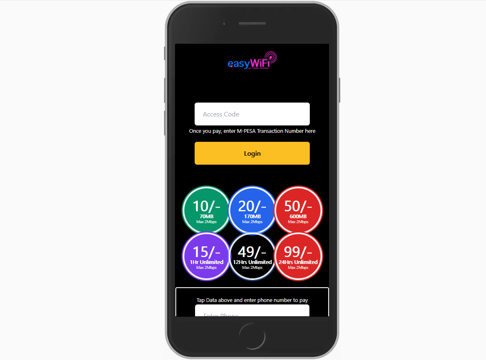

### easyWiSP Hotspot Page
This is a client  for easyWiSP service. This guides you in displaying pricing or quota allocation.
Since easyWiSP supports both Time-Limit Sessions and Quota-Limit sessions, this guide will help in
setting up prices and data allocation.

### Image


### Introduction
Hotspots require captive portal page to authenticate users. This project covers the captive portal page, compatible with Mikrotik(R) routers.

This product has been implemented to work with M-PESA Paybill or Till Numbers, but through Surv Technologies' DPC X product, configured to work out-of-the box.

### Setting up prices
Open ```prices.json```
<br /><br />

### Setup
- [x] - Change wifi name edit ```wifi_name:"",```<br />
- [x] - Change Page Title edit ```title:"",```<br />
- [x] - Change logo edit ```logo:"",``` -> Upload your logo to the root directory and write the name of the image, including the extension<br />
- [x] - Change shortcode(Store Number if Till Number, or Paybill Number if using a Paybill) edit ```shortcode:"",```<br />
- [x] - Change Type of M-PESA Shortcode(PAYBILL = 1, TILL=0) edit ```paybill:"",```<br />
- [x] - Change Paybill No(Your Paybill Number or Till Number *This is the point users will pay to incase of manual payments) edit ```pqybill:"",```<br /><br />

### Pricing & Limits
```quota``` ``[Required]``- represents Quota-Limited data usage. This is in MB, GB, TB etc<br />

### To edit this ad add your pricing and quotas, here is the guide<br />
```quota_limit```  ``[Required]``- Quota Allocation that user will get. SHould be in MB, GB, TB etc<br />
```price``` - How much users should pay eg 10, 20, 400 etc<br />
```duration_limit``` ``[Optional]`` Time will take to expire bundles whether used or unused.<br />
```color``` ``[Required]`` - String - from supported colors

### To edit this ad add your pricing and Time Limits, here is the guide<br />
This is under ```duration```
here, you will edit ```price``` and ```duration_limit```
<br />

```duration_limit``` is time for the package, eg ``1 Hr Unlimited``, ``30Days Unlimited ``etc<br />
Price, color refers to the same as the one on quotas


### Supported Colors
- red
- green
- purple
- blue
- black
- gray

```server``` is reserved for notifications set on easyWiSP dashboard.